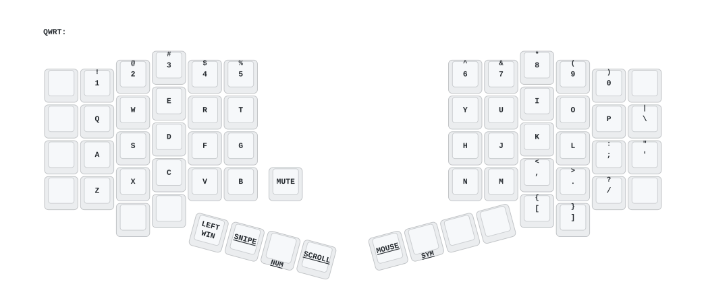
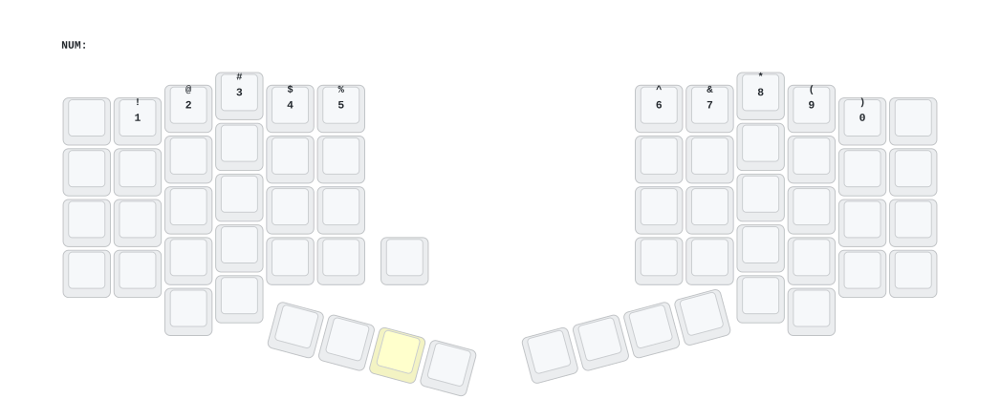
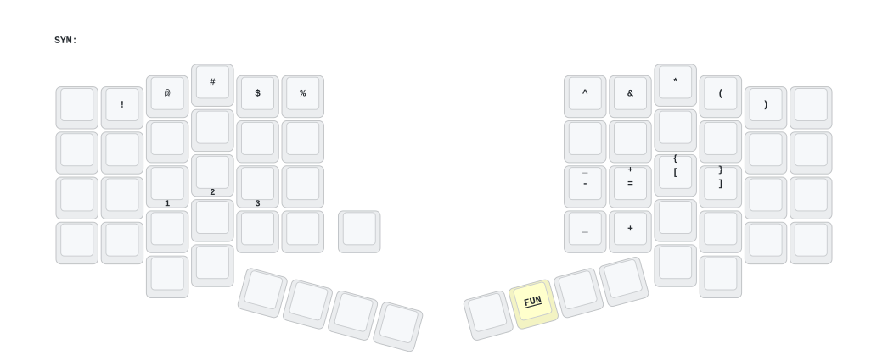
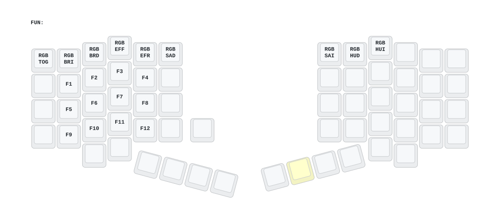
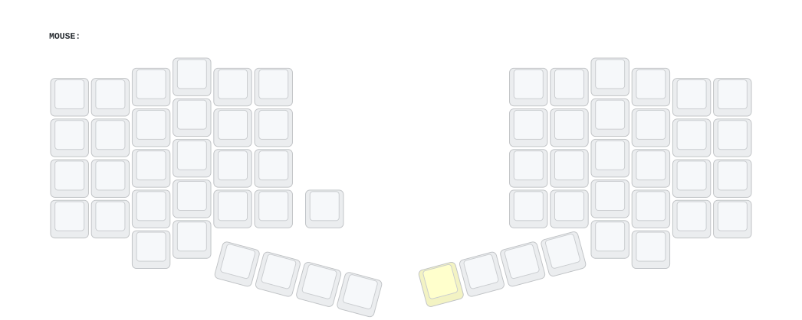

# zmk-config-hpd

[简体中文](README.md) | [English](README_EN.md)

---

[ZMK](https://zmk.dev/) firmware configuration repository for the **HPD** split ergonomic keyboard. The default branch is **`dya`**.

That branch builds on stock ZMK by adding **DYA Studio** (cormoran's enhanced ZMK Studio fork), moving a large amount of configuration — keymap, macros, combos, trackball parameters, encoder behaviour, battery history — away from "edit code, rebuild, reflash" and into "change it in the browser, effective immediately, persisted to flash".

---

## Table of Contents

- [1. Project Overview & Hardware](#1-project-overview--hardware)
- [2. Layout & Key Assignments](#2-layout--key-assignments)
- [3. Firmware Features](#3-firmware-features)
- [4. Building & Flashing](#4-building--flashing)
- [5. Customisation](#5-customisation)
- [6. Repository File Index](#6-repository-file-index)

---

## 1. Project Overview & Hardware

### 1.1 Keyboard model

**HPD** — a **split ergonomic keyboard** with 6 columns × 5 rows, a thumb cluster and one bottom extra key, one half per side (`requires: [pro_micro]`). **61 keys in total** (the matrix is 12 columns × 6 rows = 72 positions, of which 61 are populated).

| Item | Description |
| --- | --- |
| Model | HPD (shield name `HPD`, sub-shields `HPD_left` / `HPD_right`) |
| Architecture | Split keyboard (`CONFIG_ZMK_SPLIT=y`) |
| Left half (peripheral) | Key matrix, EC11 rotary encoder, WS2812 underglow |
| Right half (central) | Key matrix, PMW3610 trackball, WS2812 underglow, USB/BLE host link, DYA Studio RPC |
| Matrix size | 6 rows × 6 columns per half; `default_transform` is 12 columns × 6 rows, with the right half offset via `col-offset = <6>` into columns 6–11 |
| Power | `CONFIG_ZMK_EXT_POWER=y` (external power) |

### 1.2 MCU and firmware approach

| Item | Value |
| --- | --- |
| MCU | **nice!nano v2** (nRF52840) |
| Board notation | `nice_nano//zmk` (ZMK board name + ZMK board revision selector) |
| Firmware baseline | `cormoran/zmk`, revision `e5c9b69` (main + dya) — **not** upstream ZMK |
| Zephyr | `7c6b4cc` (v4.1.0 + zmk-fixes + nrf-half-duplex-uart) |
| Wireless | BLE 5, `CONFIG_BT_CTLR_TX_PWR_PLUS_8=y` (+8 dBm TX power) |

> ⚠️ This branch **cannot** be built with upstream `zmkfirmware/zmk`. Every remote in `west-dependency.yml` points at `https://github.com/cormoran`, pinned to concrete commit hashes. Bump them deliberately.

---

## 2. Layout & Key Assignments

### 2.1 Layout diagrams

The diagrams below are split by layer from `keymap-drawer/HPD.svg`, and are regenerated automatically whenever `config/HPD.keymap` changes.

**Default layer (QWRT)**



**NUM / SYM / FUN layers**

| NUM | SYM | FUN |
| --- | --- | --- |
|  |  |  |

**MOUSE layer** (SCROLL and SNIPE are fully transparent layers that only change the trackball processing chain, so they are not shown separately)



Full drawing (all 7 layers): [`keymap-drawer/HPD.svg`](keymap-drawer/HPD.svg)

### 2.2 Layers and how to reach them

| Index | Label | Name | How to enter | Encoder |
| --- | --- | --- | --- | --- |
| 0 | `QWRT` | Default layer | — | Volume |
| 1 | `NUM` | Number / arrow layer | Hold R4-0 | Scroll |
| 2 | `SYM` | Symbol layer | Hold R4-11 | — |
| 3 | `FUN` | Function / RGB layer | From SYM layer, press R4-11 | — |
| 4 | `MOUSE` | Mouse buttons layer | Hold R4-10 | — |
| 5 | `SCROLL` | Slow-trackball / scroll layer | Hold R4-1 | — |
| 6 | `SNIPE` | Snipe (slowed trackball) layer | Hold R4-5 | — |

> The default layer has no direct key for FUN (3) — press R4-11 to reach SYM first, then `&mo 3` at that same position.

### 2.3 Default layer (QWRT) keymap

Every layer holds **61 bindings** (5 rows × 12 columns + 1 bottom extra key). Rows below are laid out by matrix position, **left half (columns 0–5) first, then right half (columns 6–11)**.

| Row | Left half (cols 0–5) | Right half (cols 6–11) |
| --- | --- | --- |
| **R0** | `ESC` `1` `2` `3` `4` `5` | `6` `7` `8` `9` `0` `BACKSPACE` |
| **R1** | `TAB` `Q` `W` `E` `R` `T` | `Y` `U` `I` `O` `P` `\` <sup>`\|`</sup> |
| **R2** | `CAPS` `A` `S` `D` `F` `G` | `H` `J` `K` `L` `;` `'` <sup>`"`</sup> |
| **R3** | `LSHIFT` `Z` `X` `C` `V` `B` | `N` `M` `,` `.` `/` `RSHIFT` |
| **R4** | `NUM` `SCROLL` `CTRL` `ALT` `GUI` `SNIPE` | `BACKSPACE` `DELETE` `[` `]` `MOUSE` `SYM` |
| **R5** | extra key `MUTE` (col 0) | — |

- **Bottom extra key**: `&kp K_MUTE` is the only key in matrix row 6, on the innermost position of the left half.
- **A mismatch between keymap and `HPD.json` labels is expected**: `label` in `HPD.json` describes the **keycap legend**, while the keymap holds the actual function. **Edit `HPD.keymap` to change key assignments**; only touch `HPD.json` when changing the physical layout.

### 2.4 Layer highlights

All positions below are matrix row/column indices (cols 0–11).

**NUM (1)** — only 14 active keys, everything else passes through

| Position | Keys |
| --- | --- |
| R0 cols 1–10 | `1` `2` `3` `4` `5` `6` `7` `8` `9` `0` |
| R2 cols 1–4 | `←` `↓` `↑` `→` |

**SYM (2)** — Bluetooth selection + symbols

| Position | Keys |
| --- | --- |
| R0 cols 1–10 | `!` `@` `#` `$` `%` `^` `&` `*` `(` `)` |
| R2 cols 1–4 | `BT_CLR` `BT_SEL 0` `BT_SEL 1` `BT_SEL 2` |
| R2 cols 6–9 | `-` `=` `[` `]` |
| R3 cols 6–7 | `_` `+` |
| R4 col 11 | `&mo 3` → enter the FUN layer |

**FUN (3)** — RGB control + F-keys

| Position | Keys |
| --- | --- |
| R0 cols 0–8 | `RGB_TOG` `RGB_BRI` `RGB_BRD` `RGB_EFF` `RGB_EFR` `RGB_SAD` `RGB_SAI` `RGB_HUD` `RGB_HUI` |
| R1 cols 1–4 | `F1` `F2` `F3` `F4` |
| R2 cols 1–4 | `F5` `F6` `F7` `F8` |
| R3 cols 1–4 | `F9` `F10` `F11` `F12` |

**MOUSE (4)**

| Position | Keys |
| --- | --- |
| R2 cols 1–4 | `←` `↓` `↑` `→` |
| R4 col 6 | `&mkp MCLK` (**middle mouse button**) |
| R4 col 10 | `&mkp LCLK` (**left mouse button**) |
| R4 col 11 | `&mkp RCLK` (**right mouse button**) |

> ZMK naming follows the mouse side: `LCLK` = left mouse button, `RCLK` = right mouse button, `MCLK` = middle mouse button.

**SCROLL (5) / SNIPE (6)**: all 61 bindings are `&trans`, with no ordinary key positions at all. They only alter the trackball input-processor chain (see [3.3](#33-trackball-and-encoder)).

---

## 3. Firmware Features

### 3.1 DYA Studio feature modules

The core of the `dya` branch. All of these live in **`HPD_right.conf`** (right half, central). The left half receives synced values via `CONFIG_ZMK_SPLIT_RELAY_EVENT` + `CONFIG_ZMK_CUSTOM_SETTINGS_SPLIT_RPC_RELAY`.

| Studio tab | What it does | Matching west module |
| --- | --- | --- |
| Connection | Bluetooth device management, OS detection, default-layer switching | `zmk-module-ble-management`, `zmk-feature-os-detection`, `zmk-feature-default-layer` |
| Settings | Per-key persistent settings | `zmk-module-settings-rpc`, `zmk-feature-custom-settings` |
| Keymap | Layout preview, runtime macros, runtime combos | `zmk-feature-module-physical-layout`, `zmk-feature-runtime-macro`, `zmk-feature-runtime-combo` |
| Trackball | CPI, axis scaling/rotation/inversion, inertia, axis snapping, temp-layer | `zmk-module-runtime-input-processor`, `zmk-driver-pmw3610-with-custom-studio-rpc` |
| Sensor rotation | Per-layer encoder CW/CCW behaviour | `zmk-behavior-runtime-sensor-rotate` |
| Diagnostics | Device info, hardware watchdog | `zmk-feature-device-info`, `zmk-feature-watchdog` |
| Battery history | Battery discharge curve logging | `zmk-module-battery-history` |

Changes made in the Keymap, Settings, Trackball, Sensor rotation and Battery history tabs **do not require rebuilding the firmware** — saving in the browser is enough, and the values persist.

### 3.2 Display and theming

> **This repository has no display.** There is no `CONFIG_ZMK_DISPLAY` / SSD1306 / OLED configuration anywhere, and no display module is pulled in.

**"Theme" means the RGB underglow**:

| Setting | Value | Meaning |
| --- | --- | --- |
| `CONFIG_ZMK_RGB_UNDERGLOW` | `y` | Enable underglow |
| `CONFIG_ZMK_RGB_UNDERGLOW_ON_START` | `y` | Light up at boot |
| `CONFIG_ZMK_RGB_UNDERGLOW_SAT_START` | `0` | Start saturation 0 (white) |
| `CONFIG_ZMK_RGB_UNDERGLOW_BRT_START` | `30` | Start brightness 30% |
| Driver | `CONFIG_WS2812_STRIP_SPI` + `CONFIG_LED_STRIP` | WS2812 over SPI3 (MOSI = P0.11), `chain-length = 1` per half |

Underglow colour, brightness and effect speed are adjustable at runtime from the **FUN layer**: `RGB_TOG` (on/off), `RGB_BRI`/`RGB_BRD` (brightness ±), `RGB_EFF` (cycle effect), `RGB_EFR` (effect speed ±), `RGB_SAD`/`RGB_SAI` (saturation ±), `RGB_HUD`/`RGB_HUI` (hue ±).

### 3.3 Trackball and encoder

**Hardware**

| Item | Value |
| --- | --- |
| Sensor | PMW3610, devicetree compatible `cormoran,pmw3610` |
| Placement | **Right half only (central)**; `status = "disabled"` by default in `HPD.dtsi`, enabled by `HPD_right.overlay` |
| Bus | SPI1 @ 2 MHz, CS = P0.22 (active low), IRQ = P0.20 |
| Axis mapping | `SWAP_XY` + `INVERT_X` + `INVERT_Y` |
| CPI | **400** (`&trackball { cpi = <400>; }`) |

**Encoder**: `alps,ec11`, on the **left half**, `steps = <20>`, `triggers-per-rotation = <10>`, `A`=P0.29, `B`=P0.31.

**Input processor chain** (`trackball_listener` in `HPD_right.overlay`)

| Active on | Chain |
| --- | --- |
| Default (all layers) | `&mouse_runtime_input_processor &scroll_runtime_input_processor` |
| Layer 5 `SCROLL` | `&zip_xy_scaler 1 2 &scroll_runtime_input_processor` (XY at half rate + convert to scroll) |
| Layer 6 `SNIPE` | `&zip_xy_scaler 1 2 &mouse_runtime_input_processor` (XY at half rate) |

- `mouse_runtime_input_processor`: `temp-layer-enabled`, `temp-layer = <4>` (MOUSE layer), activation delay `0 ms`, deactivation delay `700 ms` — moving the trackball switches to the MOUSE layer automatically; pressing a key or timing out returns to the default layer.
- `scroll_runtime_input_processor`: `active-layers = <BIT(5)>`, `xy-to-scroll-enabled`, `axis-snap-threshold = <100>`.

**Runtime Sensor Rotate (per-layer encoder bindings)**

Via the custom RPC subsystem `cormoran_rsr`, encoder CW/CCW behaviour can be redefined **per layer** from Studio's "Sensor rotation" tab, and the configuration persists. The keymap currently defines three instances:

| Instance | Used by | Behaviour |
| --- | --- | --- |
| `rsr_vol` | Default layer | Volume up / down |
| `rsr_scroll` | NUM layer | Scroll, `tap-ms` 100 |
| `rsr_none` | All other layers | Transparent (no default behaviour) |

> Every layer must bind an `&rsr_*` instance. A layer that omits `sensor-bindings` or binds `&trans` is **invisible** in Studio.

---

## 4. Building & Flashing

### 4.1 The three build targets

`build.yaml`:

| Target | Board / shield | Artifact |
| --- | --- | --- |
| Left half | `nice_nano//zmk` + `HPD_left` | `nice_nano__zmk_HPD_left.uf2` |
| Right half | `nice_nano//zmk` + `HPD_right` | `nice_nano__zmk_HPD_right.uf2` |
| Reset | `nice_nano//zmk` + `settings_reset` | clears saved Studio settings |

The right-half target carries `snippet: studio-rpc-usb-uart`, which binds Studio RPC to the USB CDC-ACM serial port.

### 4.2 Option A: GitHub Actions (recommended)

`.github/workflows/build.yml` runs on pushes to `master` / `dya`, on pull requests, and on manual dispatch, uploading artifacts as workflow artifact `hpd`.

To build and publish a Release manually: **Actions → Build ZMK firmware → Run workflow → fill in `release` (e.g. `v0.1.0`)**.

### 4.3 Option B: local west build

Prerequisites: `west`, `cmake`, `ninja`, `arm-none-eabi-gcc` (Zephyr SDK).

```bash
# dependencies inside the repo at ./dependencies (the CI approach, recommended)
make init-standalone
make build-all

# or: dependencies one level up (standard west workspace layout)
make init-workspace
make build-all
```

Debug build (enables `zmk-usb-logging`, trading some size for logs):

```bash
make debug-all      # equivalent to west zmk-build -S zmk-usb-logging
```

After building, firmware lands at:

```
build/nice_nano__zmk_HPD_left/zephyr/zmk.uf2
build/nice_nano__zmk_HPD_right/zephyr/zmk.uf2
```

### 4.4 Flashing to the keyboard

This repository does **not** ship a `west flash` target; flashing is done by dragging the UF2 onto the bootloader drive:

1. Put the nice!nano v2 into bootloader: hold **RESET**, release it, then immediately double-tap any key on either half (or hold RESET while replugging USB).
2. A removable drive `NICE_NANO` appears.
3. **Drag the matching `zmk.uf2` onto that drive** and wait for the indicator LED to stop blinking.
4. Unplug and reset; the keyboard boots (underglow comes on solid white at 30% brightness).

**Do not flash the wrong half.** On first pair-up, **power only the right half**, complete the configuration in Studio, and only then power the left half.

### 4.5 Configuring with DYA Studio

1. Open DYA Studio in a browser.
2. **Connect the right half only** — plug the nice!nano USB cable into the **right half**.
3. Once Studio opens the CDC-ACM port over WebSerial, all tabs exposed by this firmware appear.
4. Changes are written to non-volatile storage immediately and survive reboots; the left half is synced through the split relay.

---

## 5. Customisation

### 5.1 Changing the keymap

Edit `config/HPD.keymap`. Each layer looks like this:

```dts
function_layer {
    label = "FUN";
    bindings = <
&trans  &kp F1  &kp F2   &kp F3   &kp F4   &trans  &trans  &trans  &trans  &trans  &trans  &trans
            >;
    sensor-bindings = <&rsr_none>;
};
```

- `label` is the layer name shown by DYA Studio / keymap-drawer.
- Each line of 12 bindings corresponds to the matrix's 12 columns (**6 on the left half + 6 on the right**, not "one row per half").
- `&trans` passes through to the layer below.
- Rebuild and reflash with `make build-all` afterwards.

> **Reflash-free alternative**: DYA Studio's "Keymap" tab supports runtime macros and runtime combos. Changes of those two kinds **do not require rebuilding the firmware** — saving in the browser is enough.

### 5.2 Changing behaviors / macros

**Static behaviors** (require a build):

- Standard ZMK behaviors: edit `config/HPD.keymap`, adding `#include <behaviors/...>` where needed.
- Custom behaviors: define them under `/ { behaviors { ... }; };` (that node is currently empty).
- Runtime sensor rotate instances: `rsr_vol` / `rsr_scroll` / `rsr_none`, with properties `tap-ms`, `cw-binding`, `ccw-binding`.

**Runtime macros / combos** (no rebuild): configure them in Studio's "Keymap" tab.

**Temporary-parameter behaviors** (from `zmk-module-runtime-input-processor`):

```dts
&hdpi   // hold for temporary speed-up (default 3/2)
&ldpi   // hold for temporary slow-down (default 1/2)
&hscr   // high scroll speed
&lscr   // low scroll speed
&ysnap AXIS_SNAP_MODE_Y 100   // hold to snap to Y axis (threshold 100)
&xsnap AXIS_SNAP_MODE_X 50    // hold to snap to X axis (threshold 50)
&amka   // hold to keep the temp-layer active
```

The keymap already includes `#include <behaviors/runtime-input-processor.dtsi>` and `<dt-bindings/zmk/runtime_input_processor.h>`; adjust the default ratios with `&hdpi { scale-multiplier = <3>; scale-divisor = <2>; };`.

### 5.3 Changing the lighting theme

**Firmware defaults** (`config/HPD.conf`):

```conf
CONFIG_ZMK_RGB_UNDERGLOW_ON_START=y
CONFIG_ZMK_RGB_UNDERGLOW_SAT_START=0
CONFIG_ZMK_RGB_UNDERGLOW_BRT_START=30
```

**Runtime adjustment from the keyboard**: the 9 `&rgb_ug` bindings in the top row of the FUN layer (see [2.4](#24-layer-highlights)).

**Hardware spec** (`HPD_left.overlay` / `HPD_right.overlay`, identical on both sides):

```dts
led_strip: ws2812@0 {
    compatible = "worldsemi,ws2812-spi";
    spi-max-frequency = <4000000>;
    chain-length = <1>;
    spi-one-frame = <0x70>;
    spi-zero-frame = <0x40>;
    color-mapping = <LED_COLOR_ID_GREEN LED_COLOR_ID_RED LED_COLOR_ID_BLUE>;
};
```

### 5.4 Changing sensor parameters

**Static** (`config/HPD.keymap` + `HPD_right.conf`):

```dts
&trackball { cpi = <400>; };                  /* keymap */
&mmv { time-to-max-speed-ms = <500>; acceleration-exponent = <1>; trigger-period-ms = <16>; };
&msc { acceleration-exponent = <1>; time-to-max-speed-ms = <100>; delay-ms = <0>; };
```

**Runtime** (no rebuild): Studio's "Trackball" tab exposes CPI, axis scaling/rotation/inversion, inertia, axis snapping and temp-layer. Runtime settings override the static values.

### 5.5 Layout visualisation

`.github/workflows/keymap_drawer.yml` uses `caksoylar/keymap-drawer@v0.23.0` and redraws automatically whenever `config/**` changes, producing:

- `keymap-drawer/HPD.svg` — all 7 layers
- `keymap-drawer/HPD.yaml` — layout description
- `keymap-drawer/layers/*.svg` — per-layer images (used in section 2.1)

Styling is controlled by `keymap_drawer.config.yaml`.

`config/HPD.json` is the **structured description** of the layout (key labels, row/column, coordinates, rotation `r`/`rx`/`ry`, plus the `left_encoder` sensor definition), shared by keymap-drawer and Studio's layout preview — **when you change a rotated key in `HPD.dtsi`, update it here too** or the preview will not match the physical board.

### 5.6 Upgrading the DYA Studio modules

Every revision in `config/west-dependency.yml` is a concrete commit hash. To upgrade:

1. Edit the relevant `revision:` to the target commit.
2. `west update --narrow`.
3. Verify with `make build-all` (build both halves together).

---

## 6. Repository File Index

```
.
├── Makefile                          # make init-standalone / init-workspace / build-all / debug-all
├── build.yaml                        # three build targets (left / right / settings_reset)
├── .gitignore                        # build/ dependencies/ .west/
├── keymap_drawer.config.yaml         # keymap-drawer styling
├── .github/workflows/
│   ├── build.yml                     # ZMK build + artifact + optional Release
│   └── keymap_drawer.yml             # automatic redraw via keymap-drawer v0.23.0
├── keymap-drawer/
│   ├── HPD.svg                       # all 7 layers
│   ├── HPD.yaml                      # layout description
│   └── layers/*.svg                  # per-layer images (used in section 2.1)
└── config/
    ├── HPD.conf                      # config shared by both halves (BLE tuning, underglow, ext power)
    ├── HPD.keymap                    # 7 layers + sensor bindings + input processors  ★core
    ├── HPD.json                      # structured layout description (rotation origins, encoder definition)
    ├── west.yml                      # workspace manifest (imports west-dependency)
    ├── west-dependency.yml           # DYA Studio dependencies, pinned per commit  ★core
    ├── west-standalone.yml           # standalone manifest (path-prefix: dependencies)
    └── boards/shields/HPD/
        ├── Kconfig.defconfig         # split / central role declaration
        ├── Kconfig.shield
        ├── HPD.dtsi                  # physical_layout, matrix transform, kscan, EC11, PMW3610 (disabled)  ★core
        ├── HPD.zmk.yml               # shield metadata + features
        ├── HPD.conf                  # (empty; shared config lives in config/HPD.conf)
        ├── HPD_left.overlay          # left: kscan GPIO, WS2812, encoder enabled
        ├── HPD_left.conf             # left-half Kconfig (peripheral)
        ├── HPD_right.overlay         # right: kscan GPIO, WS2812, SPI1 trackball, input listener
        └── HPD_right.conf            # right-half Kconfig (central + all DYA RPC)  ★core
```

---

## References

- [ZMK official documentation](https://zmk.dev/docs/)
- [DYA Studio developer guide](https://dya-studio-dev.cormoran707.workers.dev/developer-guide)
- [cormoran/zmk](https://github.com/cormoran/zmk) — the ZMK fork this repository depends on
- [cormoran/zmk-module-runtime-input-processor](https://github.com/cormoran/zmk-module-runtime-input-processor)
- [cormoran/zmk-behavior-runtime-sensor-rotate](https://github.com/cormoran/zmk-behavior-runtime-sensor-rotate)
- [cormoran/zmk-driver-pmw3610-with-custom-studio-rpc](https://github.com/cormoran/zmk-driver-pmw3610-with-custom-studio-rpc)
- [caksoylar/keymap-drawer](https://github.com/caksoylar/keymap-drawer)

## Licence

The key layout and keymap configuration are distributed with this repository; ZMK and the individual west modules remain under their respective upstream licences.